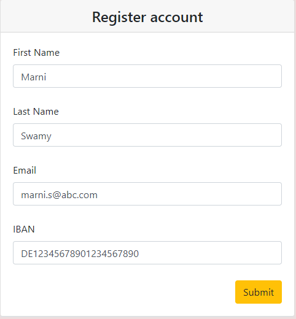

# Register Account Form

### Setup
Below are the steps to run the application.

1. `yarn`  Installs all the dependencies.
2. `yarn start:server`  Starts the local server.
2. `yarn start`  Starts the application.
3. `yarn test`  Run all the tests using the test command

Open the server is up the site will be available at `http://localhost:3000/`

## Screenshots

#### Initial Form when page loads:

#### Form with validation errors:

#### Form with valid input values:

#### Form with success result:

Once the user submits the valid data I am displaying the Modal popup with success message and entered values. Modal will disappear after 5 seconds

### Technical description

1. Created base application using create-react-app.
2. From component was created using Redux-Form library.
3. React-bootstrap library was used for the ui.
4. Setuped the local server for IBAN validation as mentioned.
5. Configured the jest for running test cases.

### Validation rules

* All fields are mandatory (required)

1. **firstName** - should contain only small and capital letters, no numbers, special characters, etc - Implemented
1. **lastName** - same as the **firstName** - Implemented
1. **email** - must be a valid email address - Implemented
1. **iban** - we want you to use asynchronous validation. Also, the server is not stable - so it will fail from time-to-time. Please use the small node server script in order to validate IBAN. - Implemented

